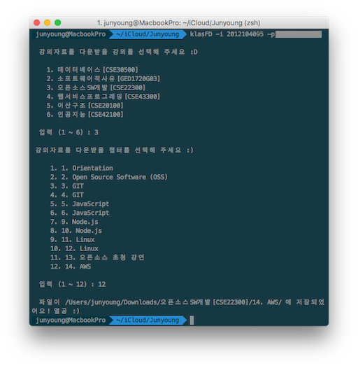

# klas-file-downloader

경희대학교 클라스의 강의실 페이지에서 강의자료를 다운받을 수 있는 데스크탑 어플리케이션과 npm 패키지입니다.

## SCREENSHOT


1. Mac / Windows Application


2. global package



## INSTALL

```
npm install -g klas-file-downloader 
```

## USAGE


1. Mac / Windows Application (추후 추가예정)

    1. Mac 
    2. Windows
    

2. npm global package

    1. 강의의 특정 챕터의 파일만 다운로드하기
    ```
    klasFM -i 2012104095 -p \!123123\*123
    ```
    2. 강의의 전체 자료 다운로드하기
    ```
    klasFM -i 2012104095 -p \!123123\*123 --all
    ```
    > **WARNING!!** 패스워드가 @ 이외의 특수문자를 포함하고 있다면, 패스워드 앞에  \ 를 붙여주어야 합니다.

### Options
#### Global Options
0. `-h / --help` : 도움말
1. `-i / --id` : **[required]** 학번
2. `-p / --pw` : **[required]** 비밀번호
3. `-d / --downloadPath` : 다운로드 받을 경로
4. `-a / --all` : 추가 시 선택한 강의의 전체 강의자료 다운로드


---
MIT License

Copyright (c) 2017 Junyoung, Sung

Permission is hereby granted, free of charge, to any person obtaining a copy
of this software and associated documentation files (the "Software"), to deal
in the Software without restriction, including without limitation the rights
to use, copy, modify, merge, publish, distribute, sublicense, and/or sell
copies of the Software, and to permit persons to whom the Software is
furnished to do so, subject to the following conditions:

The above copyright notice and this permission notice shall be included in all
copies or substantial portions of the Software.

THE SOFTWARE IS PROVIDED "AS IS", WITHOUT WARRANTY OF ANY KIND, EXPRESS OR
IMPLIED, INCLUDING BUT NOT LIMITED TO THE WARRANTIES OF MERCHANTABILITY,
FITNESS FOR A PARTICULAR PURPOSE AND NONINFRINGEMENT. IN NO EVENT SHALL THE
AUTHORS OR COPYRIGHT HOLDERS BE LIABLE FOR ANY CLAIM, DAMAGES OR OTHER
LIABILITY, WHETHER IN AN ACTION OF CONTRACT, TORT OR OTHERWISE, ARISING FROM,
OUT OF OR IN CONNECTION WITH THE SOFTWARE OR THE USE OR OTHER DEALINGS IN THE
SOFTWARE.
